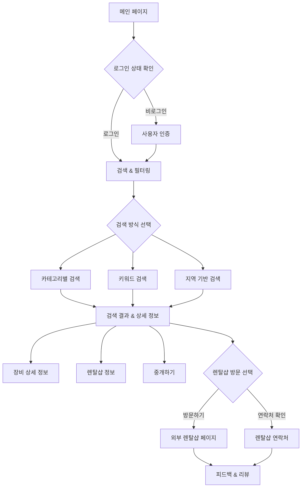
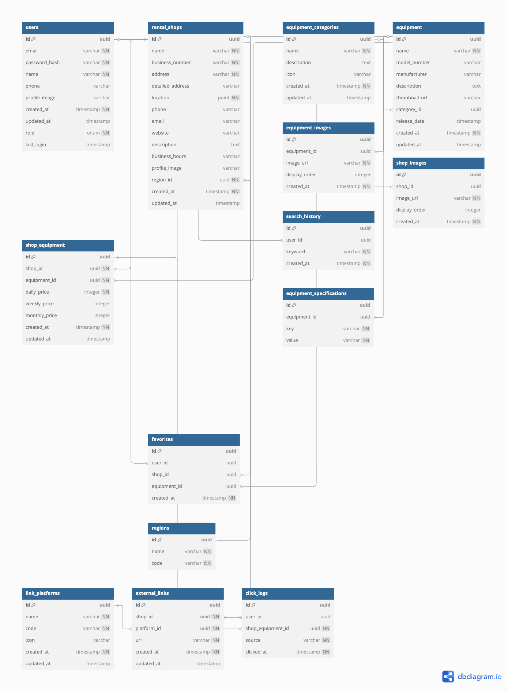

# 📸 렌탈샵 비교 플랫폼 (Rental Shop Comparison Platform)

## 🎯 프로젝트 소개

이 프로젝트는 다양한 촬영 장비 렌탈 업체들의 정보를 한 곳에서 쉽게 비교하고 검색할 수 있는 플랫폼입니다.

### 프로젝트 목적

- 사용자들이 여러 렌탈 업체의 정보를 한 눈에 비교할 수 있는 환경 제공
- 투명한 가격 정보와 사용자 리뷰를 통한 신뢰성 있는 정보 제공
- 효율적인 장비 대여를 위한 의사결정 지원
- 렌탈 업체와 사용자 간의 연결 다리 역할

## 🛠 기술 스택

### Frontend

- **Framework**: Next.js 14 (App Router)
- **Language**: TypeScript
- **Styling**: TailwindCSS
- **State Management**: Zustand
- **Form Handling**: React Hook Form
- **Data Fetching**: TanStack Query (React Query)
- **Animation**: Framer Motion
- **UI Components**: Shadcn UI

### Backend (Next.js API Routes)

- **Runtime**: Node.js
- **API**: REST API
- **Authentication**: NextAuth.js
- **Validation**: Zod

### Database & Storage

- **Main Database**: Supabase (PostgreSQL)
- **Image Storage**: Cloudinary
- **Cache**: Redis (Upstash)

### DevOps & Deployment

- **Hosting**: Vercel
- **CI/CD**: GitHub Actions
- **Monitoring**: Vercel Analytics
- **Version Control**: Git

### Development Tools

- **Code Quality**: ESLint, Prettier
- **Testing**: Jest, React Testing Library
- **API Documentation**: Swagger/OpenAPI
- **Package Manager**: pnpm

## 🏗 아키텍처

### 시스템 흐름도

#### 사용자 인증 및 검색 프로세스



### 데이터베이스 스키마



### 폴더 구조

```
src/
├── app/                    # Next.js App Router
│   ├── api/               # API Routes
│   ├── (auth)/            # 인증 관련 페이지
│   ├── (main)/            # 메인 페이지
│   └── (shop)/            # 렌탈샵 관련 페이지
├── components/            # React 컴포넌트
│   ├── common/           # 공통 컴포넌트
│   ├── layout/           # 레이아웃 컴포넌트
│   └── shop/            # 렌탈샵 관련 컴포넌트
├── lib/                  # 유틸리티 함수
│   ├── api/             # API 관련 함수
│   ├── hooks/           # Custom Hooks
│   └── utils/           # 헬퍼 함수
├── types/               # TypeScript 타입 정의
└── styles/              # 글로벌 스타일
```

### 데이터 흐름

```
Client Request → Next.js Edge → API Routes → Database
                                         ↓
                            Cache (Redis) ← Frequent Data
```

## 💡 주요 기능

### 1. 렌탈샵 검색 및 비교

- 지역, 가격, 장비 종류별 필터링
- 실시간 검색 기능
- 상세 비교 테이블

### 2. 사용자 경험

- 다크모드 지원
- 즐겨찾기 기능
- 검색 기록 저장

### 3. 정보 제공

- 렌탈샵 상세 정보
- 장비 가격 비교
- 위치 기반 추천

### 4. SEO 최적화

- 메타데이터 최적화
- 정적 페이지 생성 (ISR)
- 사이트맵 자동 생성

## 🚀 성능 최적화

### 프론트엔드

- Code Splitting
- Image Optimization
- Bundle Size 최적화
- Lazy Loading

### 백엔드

- Redis 캐싱
- Edge Functions 활용
- API Route 최적화

## 📈 모니터링 및 분석

- Vercel Analytics
- Error Tracking
- Performance Monitoring
- User Behavior Analytics

## 🔒 보안

- Rate Limiting
- CORS 설정
- Input Validation
- Authentication
- API Key 관리

## 🌱 확장 계획

- 반응형 디자인
- 예약 가능 여부 확인
- 모바일 앱 버전

## 🤝 기여하기

1. 이 저장소를 Fork 합니다
2. 새로운 Branch를 생성합니다 (`git checkout -b feature/amazing-feature`)
3. 변경사항을 Commit 합니다 (`git commit -m 'Add some amazing feature'`)
4. Branch에 Push 합니다 (`git push origin feature/amazing-feature`)
5. Pull Request를 생성합니다
